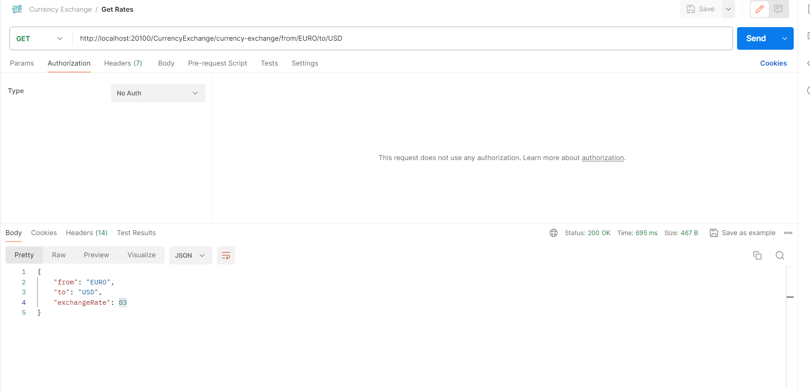
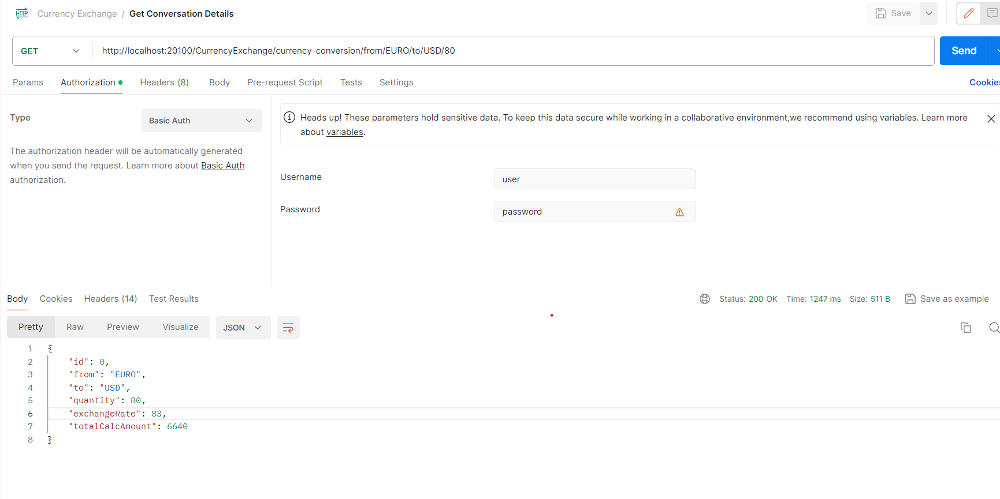

### Technologies

---

- Java 17
- Spring Boot 3.0
- Restful API
- Actuator
- Lombok
- Maven

##### <a id="getCurrencyRates"> Get Currency Rates

```
    http://localhost:20100/CurrencyExchange/currency-exchange/from/EURO/to/USD
    
   {
    "from": "EURO",
    "to": "USD",
    "exchangeRate": 83
   }
```

##### <a id="getCurrencyConversation"> Get Currency Conversation Details

```
    http://localhost:20100/CurrencyExchange/currency-conversion/from/EURO/to/USD/80
    
{
    "id": 0,
    "from": "EURO",
    "to": "USD",
    "quantity": 80,
    "exchangeRate": 83,
    "totalCalcAmount": 6640
}
```

### Screenshots

<details>
<summary>Click here to show the screenshots of project</summary>
    <p> Figure 1 </p>
    
    <p> Figure 2 </p>
    
</details>